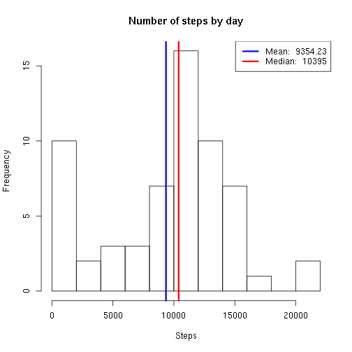
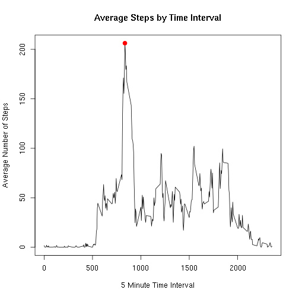
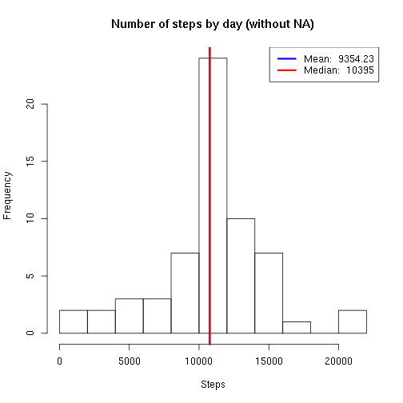
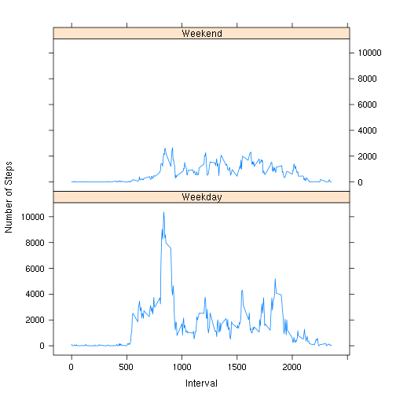

## Loading and preprocessing the data
First thing which is needed to be done - unzip and load data


```r
unzip('activity.zip')
activity <- read.csv('activity.csv')
summary(activity)
```

```
##      steps                date          interval     
##  Min.   :  0.00   2012-10-01:  288   Min.   :   0.0  
##  1st Qu.:  0.00   2012-10-02:  288   1st Qu.: 588.8  
##  Median :  0.00   2012-10-03:  288   Median :1177.5  
##  Mean   : 37.38   2012-10-04:  288   Mean   :1177.5  
##  3rd Qu.: 12.00   2012-10-05:  288   3rd Qu.:1766.2  
##  Max.   :806.00   2012-10-06:  288   Max.   :2355.0  
##  NA's   :2304     (Other)   :15840
```

## What is mean total number of steps taken per day?
Then use *aggregate* function to compute number of steps taken per day

```r
steps.by.day <- aggregate(activity$steps, list(day = activity$date), sum, na.rm = T)
```
And standard functions to compute mean and median

```r
steps.mean <- round(mean(steps.by.day$x, na.rm = T),2)
steps.median <- round(median(steps.by.day$x, na.rm = T),2)
steps.mean
```

```
## [1] 9354.23
```

```r
steps.median
```

```
## [1] 10395
```
And to create histogram with these values we use standard function *hist* and *abline* to add mean and media values.

```r
hist(steps.by.day$x, breaks=10, main='Number of steps by day', xlab='Steps')
abline(v=steps.mean, lwd=3, col='blue')
abline(v=steps.median, lwd=3, col='red')
legend('topright', lty = 1, lwd = 3, col = c("blue", "red"), legend = c(paste('Mean: ', steps.mean), paste('Median: ', steps.median)))
```

 
## What is the average daily activity pattern?
On the next step we should create a time series plot of the 5-minute interval and the average number of steps taken, averaged across all days. And we should put the maximum 5-minute interval by number of steps to the plot.

```r
steps.by.interval <- aggregate(activity$steps, list(interval=activity$interval), mean, na.rm = T)
plot(steps.by.interval$interval, steps.by.interval$x, type = 'l', main = 'Average Steps by Time Interval', xlab = '5 Minute Time Interval', ylab = 'Average Number of Steps')
steps.max <- steps.by.interval[which.max(steps.by.interval$x),]
points(steps.max$interval,  steps.max$x, col = 'red', lwd = 3, pch = 19)
```

 

```r
steps.max
```

```
##     interval        x
## 104      835 206.1698
```
It means that interval 835 has maximum average number of steps, which is 206.1698113.

## Imputing missing values
The total number of missing values (NA)

```r
sum(is.na(activity))
```

```
## [1] 2304
```
We can replace missing values with average values (we create new *activity.new* dataset for it )

```r
activity.new <- activity
activity.new$steps <- mapply(function(x,y) {if(is.na(x)) round(y) else x}, activity$steps, steps.by.interval$x)
head(activity.new)
```

```
##   steps       date interval
## 1     2 2012-10-01        0
## 2     0 2012-10-01        5
## 3     0 2012-10-01       10
## 4     0 2012-10-01       15
## 5     0 2012-10-01       20
## 6     2 2012-10-01       25
```
And create a histogram

```r
steps.new.by.day <- aggregate(activity.new$steps, list(day = activity.new$date), sum, na.rm = T)
steps.new.mean <- round(mean(steps.new.by.day$x, na.rm = T),2)
steps.new.median <- round(median(steps.new.by.day$x, na.rm = T),2)
hist(steps.new.by.day$x, breaks=10, main='Number of steps by day (without NA)', xlab='Steps')
steps.new.mean
```

```
## [1] 10765.64
```

```r
steps.new.median
```

```
## [1] 10762
```

```r
abline(v=steps.new.mean, lwd=3, col='blue')
abline(v=steps.new.median, lwd=3, col='red')
legend('topright', lty = 1, lwd = 3, col = c("blue", "red"), legend = c(paste('Mean: ', steps.mean), paste('Median: ', steps.median)))
```

 
As we can see - median value is much closer now to the mean value. It make sense - we replaced a lot of values with mean value.
## Are there differences in activity patterns between weekdays and weekends?
Let's first create new variable (weekday) for our dataset. We set locale to 'C' just for convenience (to avoid weekdays not in English).

```r
Sys.setlocale('LC_ALL', 'C')
activity.new$weekday <- factor(weekdays(as.Date(activity.new$date)))
activity.new$daytype <- factor(apply(as.matrix(activity.new$weekday),1,function(x){ if(x %in% c('Saturday','Sunday')) 'Weekend' else 'Weekday' }))
```

```r
head(activity.new)
```

```
##   steps       date interval weekday daytype
## 1     2 2012-10-01        0  Monday Weekday
## 2     0 2012-10-01        5  Monday Weekday
## 3     0 2012-10-01       10  Monday Weekday
## 4     0 2012-10-01       15  Monday Weekday
## 5     0 2012-10-01       20  Monday Weekday
## 6     2 2012-10-01       25  Monday Weekday
```
And let's create a panel plot to see the different in activity patterns between weekdays and weekends. We will use *lattice* system to build a plot.

```r
library(lattice)
activity.weekday <- aggregate(activity.new$steps, list(interval = activity.new$interval, daytype = activity.new$daytype),sum, na.rm = T)
xyplot(x~interval | daytype, data = activity.weekday, type = 'l',xlab = 'Interval',ylab = 'Number of Steps', layout = c(1,2))
```

 
